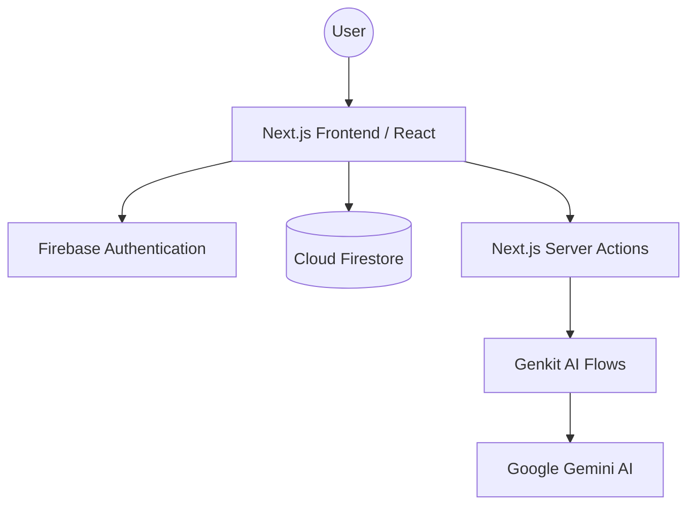

# AuraNest: Your Compassionate AI Companion ✨

AuraNest is a web application thoughtfully designed to provide a reassuring and organized digital environment for individuals with dementia or memory challenges, and to offer peace of mind to their caregivers. By leveraging the power of generative AI, AuraNest aims to enhance daily living, foster connection, and ensure safety.

## 🌟 Vision

The vision for AuraNest is to demonstrate how compassionate AI can create deeply personal and supportive experiences. AuraNest is more than just a set of tools; it's a companion that understands, remembers, and assists. It is built on the belief that technology, particularly AI, can empower individuals with cognitive decline to live with greater independence and dignity, while bridging the communication gap with their loved ones. The aim is to showcase a future where AI is not just intelligent, but also empathetic.

## ✅ Features

AuraNest is built with a suite of features designed for simplicity and accessibility:

-   **🗓️ AI-Powered Daily Planner**: A clear, time-based schedule of the day's events, from medication reminders to appointments. Integrated with AI to add reminders via voice.
-   **🗣️ Voice-First Interface**: An intuitive **Voice Assistant** allows users to navigate the app, call contacts, and set reminders using natural language.
-   **💬 Aura Chatbot**: A friendly AI chatbot, "Aura," is always available for companionship, answering questions, or simply having a conversation. It remembers your chat history for a continuous experience.
-   **🔊 Verbal Reminders & Text-to-Speech**: Create verbal reminders in multiple languages and voices. The AI can extract times from natural language and generate audio cues.
-   **📝 Memory Journal**: Users can record thoughts using voice-to-text. The AI then generates a simple, easy-to-read "Today in My Life" summary.
-   **😊 Mood Tracker**: A simple mood logger. After selecting a mood, an empathetic AI provides a short, supportive, and comforting message.
-   **🆘 Emergency SOS**: A prominent SOS button immediately sends the user's current location to designated emergency contacts.
-   **👨‍👩‍👧‍👦 Caregiver Dashboard**: Easy-to-use dashboard for caregivers to view a user's location and status.
-   **🌐 Multi-Language Support**: Available in English, Spanish, French, German, Hindi, and Italian.

## 🏗️ Architecture Documentation

### System Architecture
AuraNest follows a serverless, event-driven architecture that prioritizes real-time responsiveness and scalability.

### Data Flow
1.  **User Interaction**: Users interact with the React frontend (e.g., voice commands, mood selection).
2.  **Authentication**: Security is handled by Firebase Auth, ensuring users only access their own data.
3.  **Real-time Updates**: Changes to Firestore (like location updates) are pushed to listeners on the client immediately.
4.  **AI Processing**: Natural language is sent via Next.js Server Actions to Genkit flows.
5.  **AI Response**: Gemini processes the request and returns structured data or audio, which is then handled by the UI.

### Cloud Service Architecture
-   **Frontend/Edge**: Hosted on Firebase App Hosting, leveraging a global CDN.
-   **Compute**: Next.js Server Actions execute in a secure, serverless environment.
-   **Storage**: Cloud Firestore provides a distributed, NoSQL database for state and profile management.
-   **AI**: Genkit acts as the bridge to Google's most capable generative models.

### Scalability Considerations
-   **Auto-scaling**: All cloud components (App Hosting, Firestore, Gemini API) are fully managed and scale automatically based on traffic.
-   **State Management**: By keeping the frontend stateless and offloading data to Firestore, the application can handle thousands of concurrent users without manual intervention.

## 🛠️ Engineering Documentation

### Design Decisions
-   **Client-Side SDKs**: Used for Firestore to enable real-time features (like live location tracking) with minimal latency.
-   **Server-Side AI**: AI flows are kept on the server via Genkit to protect API keys and reduce the bundle size on the client.
-   **Component-Driven UI**: Built using `shadcn/ui` to ensure accessibility (a11y) and a consistent, professional aesthetic.

### Security Measures
-   **Firestore Security Rules**: Granular rules enforce that users can only read/write their own profiles and designated sub-collections.
-   **Encrypted Transmissions**: All data is sent over HTTPS, and sensitive AI interactions are handled server-side.
-   **Anonymous Auth**: Allows users to explore features safely before committing to a full account.

### Trade-offs
-   **Local Storage for History**: Chat history is currently stored in `localStorage` for speed and simplicity. While this means it doesn't sync across devices yet, it provides a much faster and private user experience for a prototype.
-   **Voice Recognition**: Uses the browser's Web Speech API for low-latency transcription, though it requires modern browser support.

### Future Improvements
-   **Offline Support (PWA)**: Making the app fully functional without an internet connection is a top priority for reliability.
-   **Wearable Integration**: Connecting to smartwatches to monitor vitals and detect falls automatically.
-   **Enhanced Memory**: Using a vector database to allow the Aura chatbot to remember things from months ago, not just the recent session.

## 🛠️ Tech Stack

-   **Framework**: [Next.js](https://nextjs.org/) 15 (React with App Router)
-   **Backend**: [Firebase](https://firebase.google.com/) (Auth, Firestore)
-   **AI**: [Genkit](https://firebase.google.com/docs/genkit) (Gemini models)
-   **Styling**: [Tailwind CSS](https://tailwindcss.com/) & [shadcn/ui](https://ui.shadcn.com/)

## 🚦 Project Status

**Status: Functional Prototype**

This version of AuraNest is a functional prototype demonstrating the primary vision of the application. The focus has been on showcasing the powerful and seamless integration of Genkit and Firebase to create a user-centric, AI-driven experience.

## 🚀 Getting Started

1.  **Clone the repository.**
2.  **Install dependencies:** `npm install`
3.  **Run the development server:** `npm run dev`
4.  Open [http://localhost:3000](http://localhost:3000) to see the app in action.

---

Built with ❤️ by Aisha Sultana.
